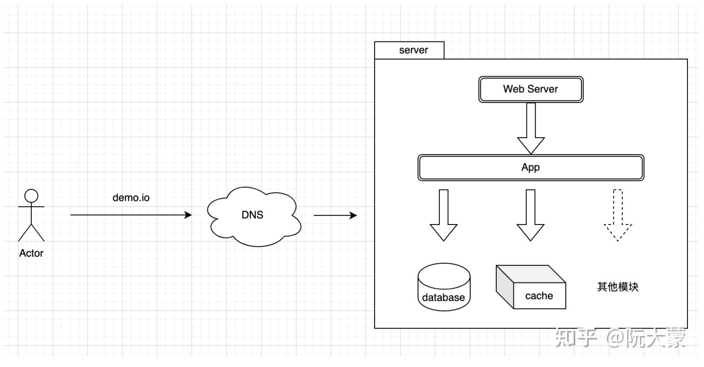
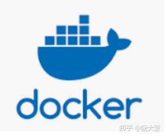
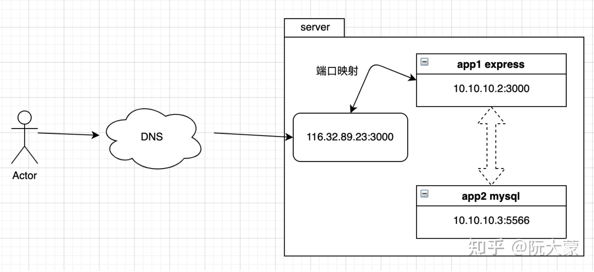
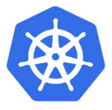
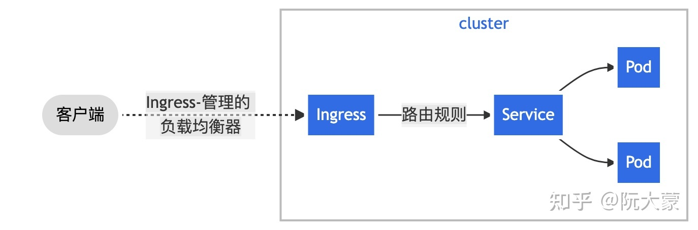
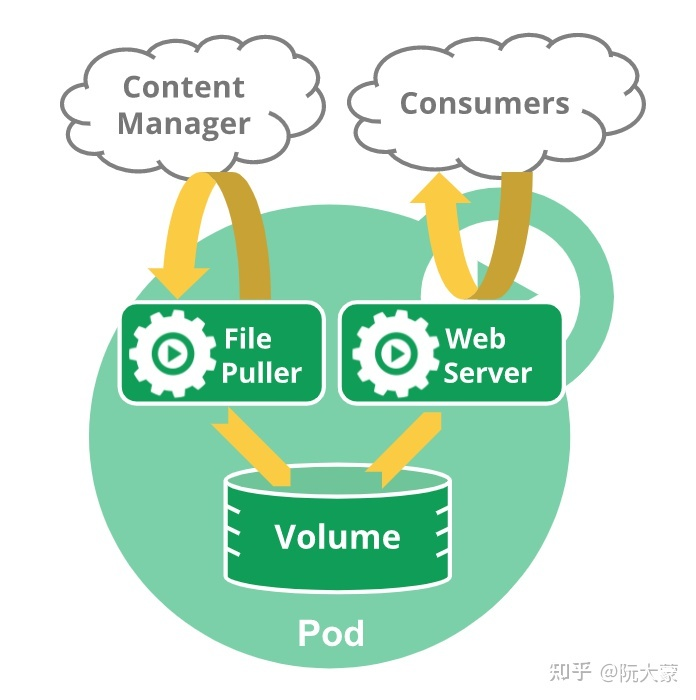

# simpread-写给前端的 K8S 上手指南

# simpread-写给前端的 K8S 上手指南

> 本文由 [简悦 SimpRead](http://ksria.com/simpread/) 转码， 原文地址 [zhuanlan.zhihu.com](https://zhuanlan.zhihu.com/p/445217118)
>

## **K8S 是什么**

在回答这个问题之前，让我们一起先了解下 web 应用部署方式的演化过程。

### **宿主机模式**

在我刚接触软件开发的时候，人们部署应用的方式通常是这样的：

首先需要一台服务器，然后在服务器上安装 Web Server （例如：Nginx 或者 Apache Server）。接着，根据应用的运行时要求，安装对应的软件包（例如：如果代码是用 Node.js 编写，就需要安装 Node.js 运行时环境）。最后，根据应用的其他功能，安装对应的软件，如数据库之类的。

应用部署的同时，宿主机上也多了各种软件程序。此时，这个 web 应用提供的服务如下图所示：



随着 web 应用的日趋复杂，这种部署方式的弊端逐渐出现了。

现代服务器性能非常强悍，如果一台主机上仅运行几个程序，就可能造成机器资源利用率**偏低**。而且，由于程序是直接运行在宿主机上的，程序之间存在资源竞争关系，会互相影响。如果**某个程序造成宿主机卡顿或挂掉，那么其他程序也无法正常工作了**。

在 2013 年出现 Docker 容器技术之后，这种部署方式逐渐被淘汰了。

### **容器**

容器技术有多种实现方式，比较主流的是 Docker。



其 logo 很好的体现了 “容器” 的特点——程序就像一个个集装箱，彼此隔离的运行在宿主机上。

区别于传统的宿主机部署模式，容器化技术提供了一个**隔离环境**。程序之间既不会互相影响，也不会影响宿主机的稳定。

Docker 方式运行的容器，可以理解为一个**虚拟机**（但和虚拟机还是有区别的，虚拟机是对硬件的虚拟化；Docker 是操作系统层的虚拟化）。它包含了运行程序所需的运行时环境和程序代码，启动后能够以端口映射的方式，将容器自身的服务暴露给宿主机和外部用户。

容器之间除了彼此隔离之外，也能够通过 Docker 引擎实现互联。容器之间的访问通常是以内部 IP 的方式进行的。



随着 web 应用规模的**继续**扩大，单主机不再能满足性能要求。现在的部署是基于**多主机、多容器**进行的。那么，如何对这些主机资源和应用容器进行管理？这个问题的答案指向了本文的主角—— K8S。

### **开源的容器管理平台**

K8S 的全称是`Kubernetes`，因为在首字母 k 和尾字母 s 中间有 8 个字母，因此被简写为 K8S（类似的还有`i18n`等）。它是由谷歌开源的，主流的容器管理平台。



它的 logo 也很有意思，K8S 就像一个舵一样，让用户能够在茫茫大海中将满载集装箱的大船驶向成功的彼岸。

借助 K8S 提供的能力，运维人员——甚至是前端开发人员——能够很容易地在集群环境中部署和管理容器。并且，对于以下功能，K8S 也能够很好地支持：

- 负载均衡
- 高可用
- 高并发（多实例）
- 集群管理

K8S 环境需要先被安装和运行起来。由于这部分的操作需要服务器支持，这里就不做介绍了。下文的全部内容都基于读者**能够连接到任一 K8S 系统**这个前提之上。

## **K8S 核心知识点**

在 K8S 中，所有资源都是通过声明式配置进行管理的，它们被称作 [K8S 对象](https://link.zhihu.com/?target=https%3A//kubernetes.io/zh/docs/concepts/overview/working-with-objects/kubernetes-objects/)。以 namespace 为例：

```other
apiVersion: v1
 kind: Namespace
 metadata:
   name: demo-space
 spec:
   finalizers:
   - kubernetes
 status:
   phase: Active
```

不同类型的对象所需的配置不完全相同，但他们都应有如下几个基础配置：

- `apiVersion` - 创建该对象所使用的 Kubernetes API 的版本，不同的版本，对于 yaml 中可使用配置项的字段、格式有不同的要求。
- `kind` - 想要创建的对象的类别
- `metadata` - 帮助唯一性标识对象的一些数据
- `spec` - 你所期望的该对象的状态

> 更详细的文档，请移步 K8S 官网。
>

常见的 K8S 对象包括 Namespace、Ingress、Sevice、Development、Pod。其中，Namespace 是一个虚拟的概念，用来对集群划分不同的命名空间。通常，同一个 Namespace 中的资源，其命名应该是唯一的。其他几种类型的资源的关系如下图所示：



### **Ingress**

通常一个集群会包含**数台物理主机**，它们都是集群的节点，这些节点需要一个统一的 IP 进行访问。Ingress 提供了这项能力，它是整个集群的流量入口。

Ingress 控制器有多种实现，比较常见的是基于 Nginx 实现的。

> Ingress-nginx 文档：[https://kubernetes.github.io/ingress-nginx/user-guide/nginx-configuration/annotations/](https://link.zhihu.com/?target=https%3A//kubernetes.github.io/ingress-nginx/user-guide/nginx-configuration/annotations/)
>

### **Sevice**

流量从 Ingress 进入集群之后，应该被分配给不同的容器处理。但通常来说，容器的 IP 不是固定的，这是因为在 K8S 中，可以随时增减容器的数量，此时容器 IP 就是动态的。

Service 是一个抽象概念，它的作用是在 Ingress 和 Pod 之间解藕它们二者的关联。它会动态获取可用的 Pod 的信息，传递给 Ingress，以保证进行正确的负载均衡。

不论是正常的增减容器数量（扩缩容）还是容器自身因为意外重启，流量总会被分配到可用的容器上。

### **Development**

Development 是用于管理副本集和容器配置的。K8S 不建议用户直接操作副本集配置，所以 Development 通常是用户所需要接触的最基础的配置。

> 副本集一组以期望的规模稳定运行的容器集合。
>

通过 Development，可以实现如下功能：

- 修改副本数量，然后副本集会以修改后的数量自动增删容器
- 修改容器配置，此时会采用先启动新的容器，然后关闭旧的容器的方式，依次更新容器。这个阶段，服务一直会处于可用的状态。

### **Pod**

Pod 是 K8S 中最小的部署单元，它包含了一组容器（可以是一个或多个）。同一个 Pod 中的不同容器之间可以通过`localhost:<port>`的方式互相访问对方暴露出来的服务，同时，容器之间可以访问共同的数据卷。多容器的使用场景通常是一个主容器加上多个 sidecar，他们彼此配合，共同实现功能需求。

以下是多容器配合的一个实例：



上图中的 Web Server 容器可以对外提供资源访问的服务，同时，File Puller 作为一个 sidecar 容器，可以同时将远端的内容更新到本地存储中，以保证 Web Server 提供的内容是最新的。

## **kubectl 工具介绍**

kubectl 是 K8S 提供的命令行工具，使得用户可以在本地对 K8S 集群发送操作指令。

> MacOS 下的安装教程：[https://kubernetes.io/zh/docs/tasks/tools/install-kubectl-macos/](https://link.zhihu.com/?target=https%3A//kubernetes.io/zh/docs/tasks/tools/install-kubectl-macos/)
>

安装完成后，创建配置文件：

```other
touch $HOME/.kube/config
```

然后在文件中加入集群配置：

> 下面的配置仅做参考，连接集群的时候需要改为对应的配置。
>

```other
apiVersion: v1
 # 集群配置，可以是多个；集群必须包含 server 字段
 clusters:
   - cluster:
       server: https://dami.net
     name: dami-c3
 # 上下文配置，可以是多个，每个上下文必须包含集群名称、namespace 名称、用户名
 contexts:
   - context:
       cluster: dami-c3
       namespace: demo-space
       user: manooog
     name: c3-demo-space-context
 # 当前默认的上下文配置，所有 kubectl 命令，都会默认使用这个上下文
 current-context: c3-demo-space-context
 kind: Config
 # 用户信息，包含用户名和对应的权限信息，可能是 token
 users:
   - name: manooog
     user:
       token: <yourToken>
```

保存好配置之后，就可以是使用 kubectl 命令对集群进行操作了。eg：

```other
kubectl get ingress # 获取当前 context 中对应的 namespace 中的 Ingress 配置
```

kubectl 功能比较多，根据使用习惯的不同，同一个功能也有不同的使用方式。下面列举一些我使用得比较多的命令。

### **查看配置**

```other
kubectl get service/<xxx> -o yaml
```

以上命令的含义是，获取名称为`xxx`的 service 对应的配置文件，并且以 yaml 格式输出。对于不同的资源，通常是以`<类型>/<名称>`进行区分的。

### **应用配置文件**

上面提到过，K8S 中一切资源都可以从声明式配置中得到。当我们想创建一个资源的时候，可以先创建对应的配置文件。然后使用以下命令使配置生效：

```other
kubectl create -f service.yaml
 kubectl apply -f service.yaml
```

以上命令都可以应用配置文件，区别就在在于，create 通常用于第一次创建，apply 则用于修改已存在的配置文件。我更倾向于使用 apply 命令。

> 二者在使用上的区别：[https://stackoverflow.com/questions/47369351/kubectl-apply-vs-kubectl-create](https://link.zhihu.com/?target=https%3A//stackoverflow.com/questions/47369351/kubectl-apply-vs-kubectl-create)
>

### **查看 Pod 输出**

```other
kubectl logs <pod> <conteiner-name>
```

获取 Pod 中对应的容器的输出信息。如果 Pod 中只有一个容器，container-name 可以省略。

### **进入容器内部命令行环境**

在容器运行过程中，可能会出现异常情况，这个时候需要进入容器内部进行检查。这个时候可以使用以下命令：

```other
kubectl exec -it demo-5b7846d65b-nvnnm -- sh
```

如果 Pod 包含多个容器，同样需要使用 `-c`参数，指定需要进入的容器名称。

## **DEMO**

这个 demo 的目标是启动一个 3 实例的 Node.js 后端程序，并实现以下效果：

```other
curl demo-20211215.io/20211215
 // -> Hello World
```

[http://demo-20211215.io](https://link.zhihu.com/?target=http%3A//demo-20211215.io) 域名指向的是集群 Ip，当请求`/20211215`这个路径的时候，期望能收到 Node.js 后端返回的字符串：`Hello World`。

由于这个示例域名是不存在的，因此我们这里利用 Hosts 进行配置。在本地 Hosts 增加一条记录，将域名直接绑定到测试集群的 Ingress IP 上：

```other
<Ingress IP> demo-20211215.io
```

现在执行测试命令，将会得到下面的提示：

```other
$ curl -v demo-20211215.io/2021215
 *   Trying <Ingress IP>...
 * TCP_NODELAY set
 * Connected to demo-20211215.io (<Ingress IP>) port 80 (#0)
 > GET /2021215 HTTP/1.1
 > Host: demo-20211215.io
 > User-Agent: curl/7.64.1
 > Accept: */*
 > 
 < HTTP/1.1 404 Not Found
 < Server: nginx/1.19.2
 < Date: Tue, 14 Dec 2021 07:10:59 GMT
 < Content-Type: text/plain; charset=utf-8
 < Content-Length: 21
 < Connection: keep-alive
```

目前集群还不能响应对于 `/20211215` 这个 path 的请求。接下来，让我们一起试着将这个服务部署起来。

### **ingress 创建**

首先，我们需要创建一条 Ingress 规则，并保存为`ingress.yml`：

```other
apiVersion: extensions/v1beta1
 kind: Ingress
 metadata:
   name: demo-20211215
   annotations:
     nginx.ingress.kubernetes.io/ssl-redirect: "false"
 spec:
   rules:
     - host: demo-20211215.io
       http:
         paths:
           - path: /20211215
             backend:
               serviceName: demo-service-20211215
               servicePort: 80
 ​
```

执行创建命令：

```other
kubectl apply -f ingress.yaml
```

接着再执行：

```other
kubectl get ingress                             
 NAME                   HOSTS                                                                          ADDRESS                                                                       PORTS     AGE
 demo-20211215          demo-20211215.io                                                     10.136.3.47,10.136.3.48,10.136.32.44,10.136.32.45,10.136.35.53,10.136.37.54   80        2m13s
```

就可以看到刚才创建的那条 ingress 规则了。这个时候，再尝试访问`demo-20211215.io/20211215`，返回结果已经有了变化：

```other
$ curl demo-20211215.io/20211215
 < HTTP/1.1 503 Service Temporarily Unavailable
 < Server: nginx/1.19.2
 < Date: Tue, 14 Dec 2021 07:20:28 GMT
 < Content-Type: text/html
 < Content-Length: 197
 < Connection: keep-alive
```

目前服务仍不可访问，但配置已生效。

配置解析：

```other
metadata.name // 这条 ingress 的规则名称，同一个 namespace 中，name 字段是唯一的。
 metadata.annotations // 这个是对 ingress 控制器的配置，视具体情况而定
 spec.rules // 匹配规则
```

在这个配置中，有一条规则。即：响应对 [http://demo-20211215.io/20211215](https://link.zhihu.com/?target=http%3A//demo-20211215.io/20211215) 这个 URL 的请求，并且将请求转发给名为 `demo-service-20211215`的这个 service 的 80 端口。

注意，这个时候尚未创建对应的 Service，但 K8S 并没有提示创建 ingress 失败。这是因为 **K8S 提供的服务发现的能力**，如果后期对应的服务被创建了，那么自然会被 ingress 识别，并分配流量过去。

### **service 创建**

创建`service.yaml`并贴入以下内容：

```other
apiVersion: v1
 kind: Service
 metadata:
   name: demo-service-20211215
 spec:
   selector:
     app: demo-app-20211215
   ports:
     - protocol: TCP
       port: 80
       targetPort: 3000
```

执行创建命令：

```other
kubectl apply -f service.yaml
```

创建好之后通过以下命令查看：

```other
kubectl get service/demo-service-20211215               
 NAME            TYPE        CLUSTER-IP      EXTERNAL-IP   PORT(S)   AGE
 demo-service-20211215   ClusterIP   10.254.40.168   <none>        80/TCP    51s
```

配置解析：

```other
metadata.name // service 的名称，在同一个 namespace 中，该字段是唯一的
 spec.selector.app // 这是一个选择器，可以选择 labels 中包含 app=demo-app-20211215 的 pod 加入这个 service 中
```

### **deployment 创建**

将下面的配置内容保存为`deployment.yaml`：

```other
apiVersion: apps/v1
 kind: Deployment
 metadata:
   name: demo-deployment-20211215
 spec:
   replicas: 3
   selector:
     matchLabels:
       app: demo-app-20211215
   template:
     metadata:
       labels:
         app: demo-app-20211215
     spec:
       containers:
         - name: demo-20211215
           image: rxh1212/demo-20211215
           ports:
             - containerPort: 3000
```

创建以及查看的命令就不再举例了。

配置解析：

```other
metadata.name // deployment 的名称，也是 namespace 中必须要唯一的
 spec.replicas // pod 的实例个数，这里是 3，表示将会部署三个应用实例
 spec.selector.matchLabels // 应该与 spec.template.metadata.labels 相同，表示的是 pod 的 labels。
 spec.template.spec.containers // 是一个数组，表示这个 deployment 所使用的容器。
```

在这里我使用了名为 `rxh1212/demo-20211215` 镜像，它是我单独编译的，包含一个 Node.js 应用。代码如下：

```other
"use strict"
 ​
 const express = require("express")
 ​
 // Constants
 const PORT = 3000
 const HOST = "0.0.0.0"
 ​
 // App
 const app = express()
 app.get("/20211215", (req, res) => {
   res.send("Hello World")
 })
 ​
 app.listen(PORT, HOST)
 console.log(`Running on http://${HOST}:${PORT}`)
```

镜像启动之后，会在 3000 端口提供一个 Http 服务。如果访问 `/20211215`，会收到`Hello World`的响应。

> 这个镜像的封装、编译过程，在此略过。感兴趣的可以在评论区留言。
>

言归正传，deployment 创建好之后，再对`demo-20211215.io/20211215`进行访问，即可得到以下响应：

```other
$ curl demo-20211215.io/20211215
 < HTTP/1.1 200 OK
 < Server: nginx/1.19.2
 < Date: Tue, 14 Dec 2021 07:25:54 GMT
 < Content-Type: text/html; charset=utf-8
 < Content-Length: 11
 < Connection: keep-alive
 < X-Powered-By: Express
 < ETag: W/"b-Ck1VqNd45QIvq3AZd8XYQLvEhtA"
 < 
 * Connection #0 to host demo-20211215.io left intact
 Hello World* Closing connection 0
```

至此，我们完成了一个简单的 K8S 部署流程。

### **源码**

以上 Demo 使用的配置代码，已上传至 github 中：[https://github.com/manooog/K8S-demo-20211215](https://link.zhihu.com/?target=https%3A//github.com/manooog/K8S-demo-20211215)

## **写在后面**

- 为什么写容器相关文章？

  容器技术在前端开发中经常会遇到，例如：Gitlab CI/CD 使用的容器技术作为构建中的一环、开源或者公司自建的容器平台产品都是以容器技术作为支撑的。为了用好基于容器技术的各种工具、更好地熟悉云产品形态，前端开发工程师们很有必要了解一下容器相关技术。本文以 K8S 为引子，介绍了软件开发中应用部署方式的迭代变化、K8S 中的基础概念以及 kubectl 工具的用法，希望能够为初学容器技术的小伙伴提供一点帮助。
- 看完之后能让读者得到什么？

  看完本文后，我希望读者能够掌握以下知识点：
- K8S 是什么
- 掌握配置和使用 kubectl 工具的方法
- 熟悉 K8S 的核心概念
- 对 “基于 K8S 部署的服务 “进行简单的故障排查和系统恢复
