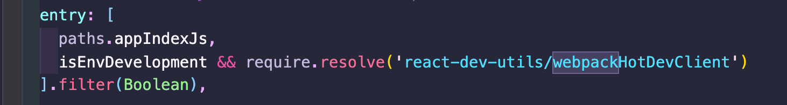

# react+webpack多页面应用的扩展

# react+webpack多页面应用的扩展

---


1. 在config/webpack.config.js里找到entry



这里面就只是显示index的路径，我们需要再config/paths.js里添加我们几个模块的路径

```other
module.exports = {
  appIndexJs: resolveModule(resolveApp, 'src/index/index'),
+  appTicketJs: resolveModule(resolveApp, 'src/ticket/index'),
+  appQueryJs: resolveModule(resolveApp, 'src/query/index'),
+  appOrderJs: resolveModule(resolveApp, 'src/order/index'),
```

2. 修改entry为对象形式

```other
entry: {
      index: [paths.appIndexJs, isEnvDevelopment && require.resolve('react-dev-utils/webpackHotDevClient')].filter(Boolean),
      query: [paths.appQueryJs, isEnvDevelopment && require.resolve('react-dev-utils/webpackHotDevClient')].filter(Boolean),
      order: [paths.appOrderJs, isEnvDevelopment && require.resolve('react-dev-utils/webpackHotDevClient')].filter(Boolean),
      ticket: [paths.appTicketJs, isEnvDevelopment && require.resolve('react-dev-utils/webpackHotDevClient')].filter(Boolean)
    },
```

3. 添加html配置

同样在config/paths里添加html

```other
appHtml: resolveApp('public/index.html'),
+  appTicketHtml: resolveApp('public/ticket.html'),
+  appQueryHtml: resolveApp('public/query.html'),
+  appOrderHtml: resolveApp('public/order.html'),
```

4. 在config/webpack.config.js里处理html

1).在plugins中将原来的HtmlWebpackPlugin进行配置修改，添加一个filename和chunks

```other
Object.assign(
          {},
          {
+            filename: 'index.html',
+            chunks: ['index']
          },
```

2). 对之前配置的每个页面都复制一个改一下它的template和filename以及chunks

```other
new HtmlWebpackPlugin(
        Object.assign(
          {},
          {
            inject: true,
            template: paths.appHtml,
            filename: 'index.html',
            chunks: ['index']
          },
          isEnvProduction
            ? {
                minify: {
                  removeComments: true,
                  collapseWhitespace: true,
                  removeRedundantAttributes: true,
                  useShortDoctype: true,
                  removeEmptyAttributes: true,
                  removeStyleLinkTypeAttributes: true,
                  keepClosingSlash: true,
                  minifyJS: true,
                  minifyCSS: true,
                  minifyURLs: true,
                },
              }
            : undefined
        )
      ),
      new HtmlWebpackPlugin(
        Object.assign(
          {},
          {
            inject: true,
            template: paths.appTicketHtml,
            filename: 'ticket.html',
            chunks: ['ticket']
          },
          isEnvProduction
            ? {
              minify: {
                removeComments: true,
                collapseWhitespace: true,
                removeRedundantAttributes: true,
                useShortDoctype: true,
                removeEmptyAttributes: true,
                removeStyleLinkTypeAttributes: true,
                keepClosingSlash: true,
                minifyJS: true,
                minifyCSS: true,
                minifyURLs: true,
              },
            }
            : undefined
        )
      )
```

如果build后报Cannot read property 'filter' of undefined，那么就需要把

new ManifestPlugin里的generate属性删掉
